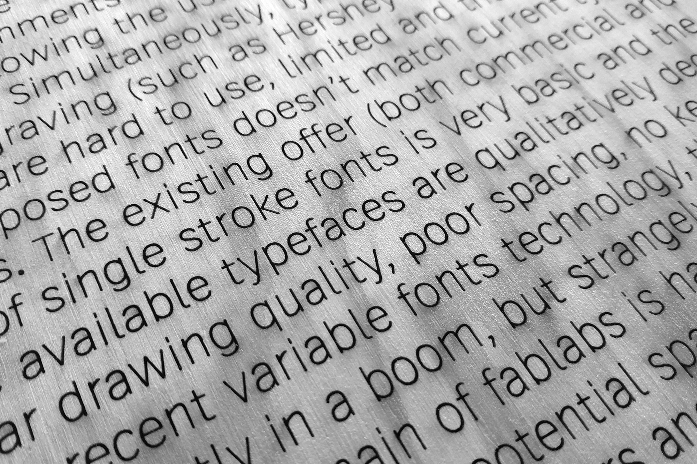

# Relief SingleLine typeface

*Relief SingleLine* is a versatile sans serif “single-line” font with open paths oriented towards CNC (Computer Numerical Control) engraving and fab labs environments. *Relief SingleLine* provides a single-line path for a pen, laser, or milling tool to follow for an efficient and clean looking typographical rendering. *Relief SingleLine* is the first single-line font running on Adobe apps (CC 2019 and above) with kerning and opentype features. *Relief SingleLine* with its skeletal logic and parametric thickness can also be useful in print and web experiments. *Relief SingleLine* typeface is an open-source project available for download and use following the Open Font License ([OFL](https://scripts.sil.org/ofl)).

## Existing CNC mill & laser typographic tools
Nowadays there is still a critically small amount of “single-line”, “single-stroke” or “central-line” fonts optimized for fab labs CNC machinery, allowing the use of letters based on a single central line. Simultaneously, typographic tools dedicated to CNC usages (such as [Hershey Text](https://wiki.evilmadscientist.com/Hershey_Text) Inkscape extension) are truly limited and the drawing quality of the proposed fonts doesn’t match current typographic standards. The existing offer (both commercial and open-source) of single-line fonts is very basic and the majority of these available typefaces are qualitatively deceptive (irregular drawing quality, poor spacing, no kerning, etc.). With the recent variable fonts technology, the type design field is currently in a boom, but strangely the rapidly democratizing domain of fab labs is hardly approached by type designers. This potential space for experimentation is practically left to engineers and “makers” which, despite all their noticeable efforts, need more typographic expertise and the help of the type design community.

## Relief SingleLine, a skeletal font for CNC machinery
*Relief SingleLine* is a versatile sans serif “single-line” font with open paths designed by students of the Graphic Design Department of the Institut Supérieur des Arts et du Design de Toulouse / [isdaT](https://www.isdat.fr/) (Élisa Garzelli & Noëlie Dayma). The project was initiated and led by François Chastanet (isdaT Graphic Design Department teacher) part of *Les Communs / Bibliothèque Infinie* pedagogical program curated by Nathalie Bruyère (isdaT Design Department teacher). The structure of this alphabet is influenced by Adrian Frutiger’s little known and underrated *Vectora* typeface. *Relief SingleLine* has several stylistic sets, proposing lowercases alternates g, l, y and a punctuation variant for small size applications (period and related signs). *Relief SingleLine* allows the user to drastically reduce the machining time while offering a quality Bézier curves rendering. 

The Relief project is based on a main skeletal .glyphs + .ufo source and explores different font format exports: 

¶ Open Paths / CNC machining (see “open-” prefix font folders)

• `OTF-SVG` for Adobe (CC ≥2019)

• `SVG` for Inkscape + Hershey Text Extension

• `TTF` for CAD softwares (like Rhinoceros 3D)

¶ Closed Outlines / Print and Web (see “outline-” prefix font folders)

• `OTF` (the closed outlines OTF version is necessary in the first steps of the Inkscape layout process)

• `WOFF2`

→ For detailed font informations check / documentation / character-map / manual + character map A4 format PDF. 

When using *Relief SingleLine* font with a laser-cutting machine, it is recommended to use the *cutting* function at low intensity and not the *engraving* function in order to reduce inscription’s tracing time on any surface (do preliminary laser power tests to determine the best speed-power couple for each material to engrave with an inscription).

# How to use the Open Paths?
## Adobe CC ≥2019: OpenType-SVG color font method
## →fonts/open_otf-svg/

As this project is primarily focusing on graphic user interface solutions opened the largest possible audiences, *Relief SingleLine* typeface is distributed as an OpenType-SVG color font format in order to simplify the layout process for the 2D fab lab community, i.e. having a single-line font editable in popular vector graphics and typographic composition softwares such as Illustrator or Indesign. OpenType-SVG technology represents an interesting alternative to permit single-line fonts wider distribution and easier use. To our knowledge, *Relief SingleLine* is the first single-line font working in Adobe apps (CC 2019 and above), opening new perspectives for makers worldwide. Fab lab users oriented towards 2D graphic practices can now easily access quality Bézier curves, kerning and OpenType features in their single-line typographical layouts!

Simply install the `ReliefSingleLine-Regular_svg.otf` on your system (or directly in the / Fonts subfolder of Illustrator or Indesign), open Illustrator or Indesign, compose your paragraphs and titlings; when the layout is finished, duplicate it and just use the / Text / Vectorize function to obtain a single-line design to export as PDF or SVG file to engrave through your favorite CNC machine (pen plotters, laser cutting or milling machine).

*Relief SingleLine* export as OpenType-SVG format was made possible thanks to [Frederik Berlaen](https://typemytype.com/)’s *SingleLine_otf-svgMaker* Python script for [Robofont](https://robofont.com/). This script permits to export any skeletal UFO-based font project towards a single-line / open paths OpenType-SVG font. *SingleLine_otf-svgMaker* uses [roundingPen](https://github.com/typemytype/outlinerRoboFontExtension/blob/master/Outliner.roboFontExt/lib/outlinePen.py) script by Frederik Berlaen. *SingleLine_otf-svgMaker* Python script is available on [SingleLine_otf-svgMaker](https://github.com/isdat-type/SingleLine_otf-svgMaker) separated isdaT-type’s Github repository.

## Inkscape + Hershey Text Extension SVG fonts method
## →fonts/open_svg/

First install `ReliefSingleLineOutline-Regular.otf` on your system; then copy `ReliefSingleLine-Regular.svg` there:

• (macOS) 

`/Applications/Inkscape.app/Contents/Resources/share/inkscape/extensions/svg_fonts`

• (Windows) 

`C:\Program Files\Inkscape\share\inkscape\extensions\svg_fonts`

Only for Windows users: if you can not use `ReliefSingleLine-Regular.svg` even if effectively copied in the / svg_fonts folder, try the following action: right-click on `ReliefSingleLine-Regular.svg` then select `/ Properties / Security / Unlock / Apply`.

Compose your layout in [Inkscape](https://inkscape.org/) using `ReliefSingleLineOutline-Regular.otf`, launch [Hershey Text Extension](https://www.evilmadscientist.com/2019/hershey-text-v30/) (now available by default) to render your text blocks as single-line letters: go to `/ Extension / Text / Hershey Text`. 

Then, in font select *Other* (bottom of the list after the existing Hershey fonts) and type `ReliefSingleLine-Regular` in the next field of the dialog box as a path-name, then apply rendering. 

Beware to first copy your source text blocks: after the Hershey Text Extension rendering process, texts are becoming not editable. Hershey Text Extension unfortunately apparently disables the kerning values even if truly embedded in the SVG font.

Process to export towards (old) SVG format with open paths:

• Open a skeletal UFO file in [FontForge](https://fontforge.org/), 

• File / Generate fonts / Select SVG font format,

• Rename your font as simple as possible to have a short path-name when using Hershey Text Extension (important: no space in the name),

• Generate,

• Open the SVG file in a text editor (such as Sublime Text) and run two find and replace actions:

— find `z" /`

— replace by `" /`

— find `zM`

— replace by `M`

• Save as a new SVG file.

## CAD softwares: “closed” TTF towards open paths method
## →fonts/open_ttf/

By definition, a TTF export is based on closed vector paths. Nevertheless [Rhinoceros 3D](https://www.rhino3d.com/) and some other CAD softwares are able to use “closed” TTF single-line fonts by opening the closed letters’ structure the right way in their design interfaces with multiple views. When previewing a closed TTF file in your system you will get a triangular surfaces kind of display, no worries, the CAD software should correctly interprets it as a single-line typeface with open paths. 

When operating the text tool dialog box, one can find a special feature to tick that permits single-line fonts usage (Windows version only in Rhinoceros 3D), then select the desired closed TTF. But composing paragraphs is often not possible, you can just write some words aligned on the same baseline (no line breaks depending on softwares), so limited to basic titling usages only.

## Drawbot + UFO method
## →sources/Relief-SingleLine.ufo

If you have some Python coding skills, you can play around with *Relief SingleLine* main .ufo source in [Drawbot](https://www.drawbot.com/) to export toward PDF or SVG textual vector patterns to engrave. UFO ([Unified Font Objects](https://unifiedfontobject.org/)) is a cross-platform, cross-application, human readable format for storing font data.

## Contributors

Élisa Garzelli & Noëlie Dayma, isdaT Graphic Design Department students.

[François Chastanet](http://francoischastanet.com/) Instagram [@francois_chastanet](https://www.instagram.com/francois_chastanet/) / Twitter [@f_chastanet](https://twitter.com/f_chastanet)), isdaT Graphic Design Department teacher in typography and type design, general design and project coordination.

[Tanguy Vanlaeys](https://vnls-tanguy.tumblr.com/) Instagram [@vnls_tanguy](https://www.instagram.com/vnls_tanguy/) + [@cnc_type](https://www.instagram.com/cnc_type/) / Twitter [@tanguy_vanlaeys](https://twitter.com/tanguy_vanlaeys), research on CNC type started at [ANRT](https://anrt-nancy.fr/), advices on Inkscape + Hershey Text Extension usages and open paths (old) SVG fonts export tricks, TTF exports, illustrations and type specimen layouts.

[Frederik Berlaen](https://typemytype.com/) Instagram [@typemytype](https://www.instagram.com/typemytype/) / Twitter [@typemytype](https://twitter.com/typemytype), *otf-svgMaker* Python script for [Robofont](https://robofont.com/) exporting from any skeletal UFO source an OTF-SVG color font permitting editable single-line typographic layouts in the Adobe environment (CC 2019 and above). 

## Abstract

Relief SingleLine → CNC machining, print and web → the first skeletal font with open paths running on Adobe apps (CC2019 and above) with kerning and OpenType features {based on .otf(-svg) format} → exports available for Inkscape + Hersey Text Extension, Rhino 3D and CAD softwares, Drawbot {.svg, .ttf, .ufo} or print and web usages {closed outlines .otf, .woff2} → Open Font License!

